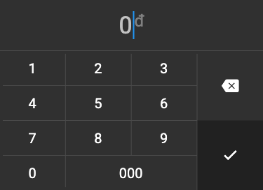

# flutter_vnd_keyboard

Vietnamese đồng keyboard for Flutter.

## Getting Started

Add this to your app's `pubspec.yaml` file:

```yaml
dependencies:
  flutter_vnd_keyboard: ^0.0.1
```

## Usage

Then you have to import the package with:

```dart
import 'package:flutter_vnd_keyboard/flutter_vnd_keyboard.dart';
```

And use `VndKeyboard` or `VndBottomSheet` where appropriate.

```dart
      RaisedButton(
        child: Text('showBottomSheet'),
        onPressed: () async {
          final value = await showModalBottomSheet(
            builder: (_) => VndBottomSheet(),
            context: context,
          );
          print('value=$value');
        },
      );
}
```

| Light theme | Dark theme |
| ----------- | ---------- |
| VndKeyboard | |
|  |  |
| VndBottomSheet | |
|  |  |
